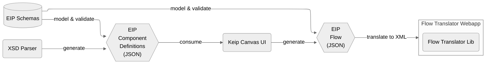

# Architecture

The Keip Canvas is a collection of modules that together power the functionality offered by the user interface.
The project is organized as a monorepo with the following subprojects:

### [EIP JSON Schemas](../schemas/README.md)

Models the JSON objects that are passed between the different modules to promote data consistency across the project.

### [XSD Parser](../xsd-parser/README.md)

Fetches XML Schema Definitions (XSD) and parses them into a catalog of EIP Components.
The resulting component definitions are then used by the Canvas UI to populate the draggable node menu and provide the
user with a specific set of configuration options for each EIP component type.

### [Keip Canvas UI](../ui/DEVELOPER.md)

A single-page web application that provides drag, drop, and link capabilities for creating integration flow diagrams.

### [Flow Translator](../flow-translator/flow-translator-webapp/README.md)

A web service that translates Flows created by the UI to target-specific integration XML documents.