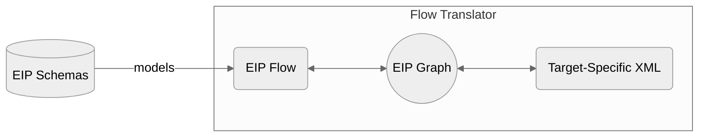

# Architecture

The [FlowTranslator](src/main/java/org/codice/keip/flow/FlowTranslator.java) class is the entrypoint to the library's main
translation functionality.
The translator provides a `toXml` method that accepts an [EIP Flow](src/main/java/org/codice/keip/flow/model/Flow.java)
object (comprised of nodes and edges) and a [Writer](https://devdocs.io/openjdk~21/java.base/java/io/writer) for storing
the output.

The `Flow` object is first translated to an intermediate representation,
an [EIP Graph](src/main/java/org/codice/keip/flow/model/EipGraph.java), which is then converted to the target XML. The IR
decouples the Flow from the target and exposes a more developer-friendly API for generating the target.

## Choosing a Target

To customize the generated XML, extend
the [GraphTransformer](src/main/java/org/codice/keip/flow/xml/GraphTransformer.java) base class. It is an abstract class
that handles the common parts of the XML generation logic. Implementations can specify the required XML namespaces by
overriding the abstract methods, in addition to controlling
individual [EIP Node](src/main/java/org/codice/keip/flow/model/EipNode.java) transformations by providing a
custom-configured [NodeTransformerFactory](src/main/java/org/codice/keip/flow/xml/NodeTransformerFactory.java). An
instance of the custom `GraphTransformer` can then be injected into the `FlowTranslator` constructor.

For an example of a `GraphTransformer` implementation, see
the [IntegrationGraphTransformer](src/main/java/org/codice/keip/flow/xml/spring/IntegrationGraphTransformer.java) which
targets Spring Integration XMLs.

## The EIP Graph

As mentioned above, the graph provides an intermediate representation between the EIP Flow and the target XML. It is
is currently implemented using the [Guava Graphs](https://github.com/google/guava/wiki/GraphsExplained) library as it
provides a simple, well-documented API for building immutable graphs, with built-in support for common graph
algorithms (e.g. BFS, DFS). Nonetheless, all external access to the graph is through
the [EIP Graph](src/main/java/org/codice/keip/flow/model/EipGraph.java) interface (which
the [GuavaGraph](src/main/java/org/codice/keip/flow/graph/GuavaGraph.java) implements), so it should be straightforward to
use a different library if the need arises.

## Future Work

- The `Flow -> Graph -> XML` translation path is currently supported. We plan to add support for the reverse
  direction (`XML -> Graph -> Flow`) as well.
- For current developers, great care must be taken to ensure the model `Records` and `Enums` are compatible with
  the [EIP Flow JSON schema](/schemas/model/json/eipFlow.schema.json) (the source of truth). There are existing tests to
  validate the models against the schema, but they are unlikely to be exhaustive. We plan to investigate schema
  code-generation capabilities for a more automated enforcement of the contract.