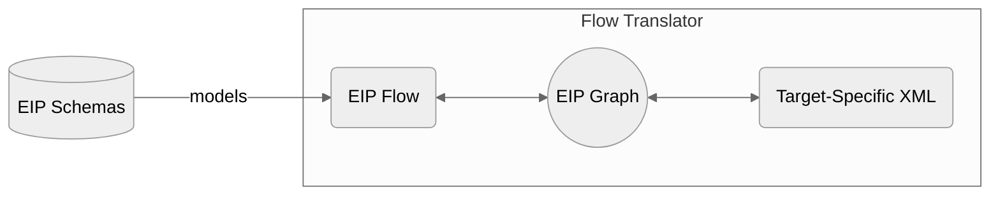

# Architecture

## FlowTranslator

The FlowTranslator class is the entry point to the library’s main translation functionality. It provides methods for
converting between the EIP Flow model and its XML representation:

- `toXml` — accepts a Flow object (comprised of nodes and edges) and a Writer for storing the output XML.
- `fromXml` — accepts an XML input stream and reconstructs a Flow from it.

Both directions of translation use an intermediate representation, the EIP Graph, to decouple the flow model from
backend formats and to expose a developer-friendly API for translation.

## Choosing a Backend Target (Flow -> XML)

To customize the generated XML, extend
the [GraphXmlSerializer](src/main/java/org/codice/keip/flow/xml/GraphXmlSerializer.java) base class. This abstract class
handles the common parts of XML generation. Implementations can override abstract methods to specify required XML
namespaces, in addition to controlling individual [EIP Node](src/main/java/org/codice/keip/flow/model/EipNode.java)
transformations. An instance of the `GraphXmlSerializer` can then be injected into the `FlowTranslator`
constructor.

For an example of a `GraphXmlSerializer` implementation, see
the [IntegrationGraphXmlSerializer](src/main/java/org/codice/keip/flow/xml/spring/IntegrationGraphXmlSerializer.java)
which targets Spring Integration XMLs.

## Parsing XML (XML -> Flow)

When translating from XML, the FlowTranslator uses
a [GraphXmlParser](src/main/java/org/codice/keip/flow/xml/GraphXmlParser.java) under the
hood. The XML is parsed into an [EIP Graph](src/main/java/org/codice/keip/flow/model/EipGraph.java), which is then
converted into a Flow, enabling symmetry with the forward direction. To customize how the XML is parsed into a graph
representation, implement the abstract [GraphXmlParser](src/main/java/org/codice/keip/flow/xml/GraphXmlParser.java).

## The EIP Graph

As mentioned above, the graph provides an intermediate representation between the EIP Flow and the target XML. It
is currently implemented using the [Guava Graphs](https://github.com/google/guava/wiki/GraphsExplained) library as it
provides a simple, well-documented API for building immutable graphs, with built-in support for common graph
algorithms (e.g. BFS, DFS). Nonetheless, all external access to the graph is through
the [EIP Graph](src/main/java/org/codice/keip/flow/model/EipGraph.java) interface
(which the [GuavaGraph](src/main/java/org/codice/keip/flow/graph/GuavaGraph.java) implements), so it should be
straightforward to use a different library if the need arises.

## Future Work

- For current developers, great care must be taken to ensure the model `Records` and `Enums` are compatible with
  the [EIP Flow JSON schema](/schemas/model/json/eipFlow.schema.json) (the source of truth). There are existing tests to
  validate the models against the schema, but they are unlikely to be exhaustive. We plan to investigate schema
  code-generation capabilities for a more automated enforcement of the contract.
- Preserve `EipNode` Descriptions in the serialized XML.